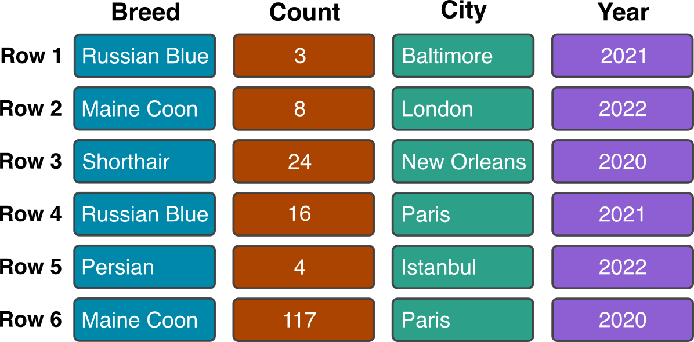
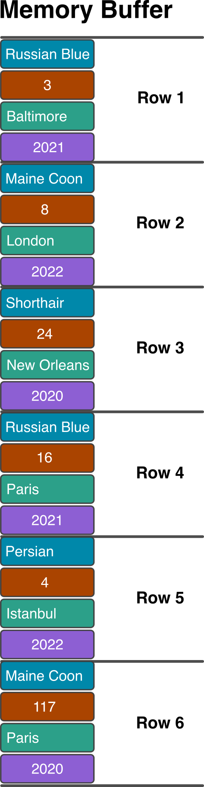
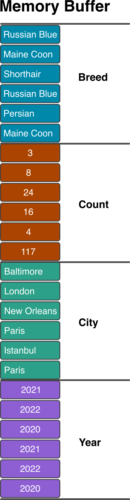
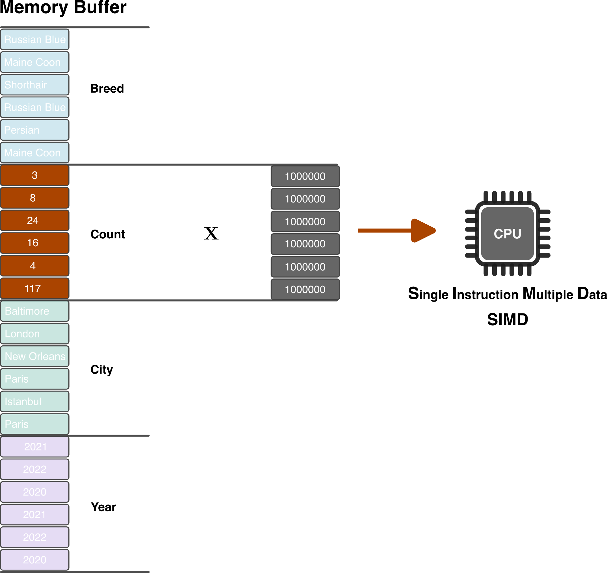
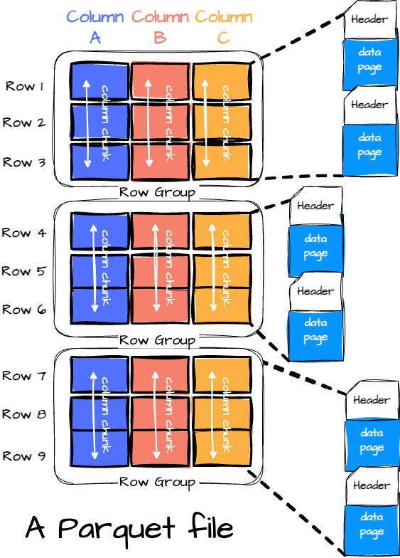
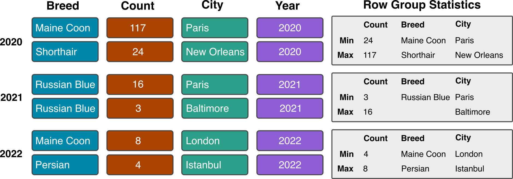
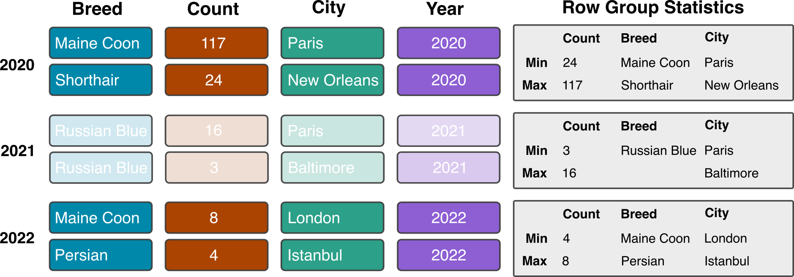

## What makes big data [BIG]{.focus}? {.center}

::: incremental
-   Tabular data often hundreds to thousands of rows.

-   The maximum number of row in an Excel worksheet is **1,048,576**.

-   Data can easily be **> 100 million** rows.

:::

## A definition ... [sort of]{.focus} {.center}

::: incremental
1.  Data that is too large to fit into memory.

- e.g. a 40 GB `.csv` but only 16 GB RAM.
- A rule of thumb: *your memory should be twice the size of your data*.

2.  Data that fits into memory but is prohibitively slow to analyze.
:::

## Apache Arrow 


:::: {.columns .center}


::: {.column width="50%"}
> Apache Arrow is a universal columnar format and multi-language toolbox for fast data interchange and in-memory analytics.

::: incremental
- Columnar is Fast!
- Arrow keeps data in a single format that can be accessed by multiple programming languages and platforms without having to copy and convert the data.
- Arrow works with multiple programming languages, including `C++`, `C#`, `Go`, `Java,` `Julia`, `Python`, and of course `R`.
::: 
:::


::: {.column width="50%"}

:::

::::

---

::::: {.columns style='display: flex !important; height: 90%;'}

::: {.column width="50%" style='display: flex; justify-content: center; align-items: center;'}

![[Row-Oriented]{.focus}](images/row.png)

:::

::: {.column width="50%" style='display: flex; justify-content: center; align-items: center;'}

![[Columnar]{.focus}](images/column.png)
:::

::::


## Row in Memory


::::: {.columns style='display: flex !important; height: 90%;'}

::: {.column width="50%" style='display: flex; justify-content: center; align-items: center;'}


:::

::: {.column width="50%" style='display: flex; justify-content: center; align-items: center;'}
{height=550}
:::

::::

## Columnar in Memory


::::: {.columns style='display: flex !important; height: 90%;'}

::: {.column width="50%" style='display: flex; justify-content: center; align-items: center;'}

:::

::: {.column width="50%" style='display: flex; justify-content: center; align-items: center;'}
{height=550}
:::

::::

--- 


{height=550}


## Some [BIG]{.focus} data

::::::: columns
:::: {.column width="50%"}

NYC Taxi and Limousine Commission (TLC) Trip Record Data

::: incremental
-   Yellow Taxi: TLC Trip Record Data from 2010 - April 2026
-   Common demonstration dataset for working with big data
-   [90 GB]{.focus} csv
-   [1,670,942,457]{.focus} rows (that's alot of :taxi: rides!)
:::
::::

:::: {.column width="50%"}


::: {style="font-size: 50%;"}
<https://www.nyc.gov/site/tlc/about/tlc-trip-record-data.page>
:::
::::
:::::::

## Load NYC Taxi Data

```{r}
library(arrow)
library(tictoc)
tic()

nyc_taxi <- open_dataset(
  "../data/nyc-taxi-csv/nyc_yellow_taxi.csv",
  format = "csv"
)

toc()
```

## Load NYC Taxi Data

```{r}
library(arrow)
nyc_taxi <- open_dataset(
  "../data/nyc-taxi-csv/nyc_yellow_taxi.csv",
  format = "csv"
)

nyc_taxi
```

## `arrow` + `dplyr` query

We can use familiar `dplyr` verbs when working with an Arrow Dataset. 

. . .

> Calculate the percent of rides that are shared by year
 
. . . 

```{r}
#| eval: FALSE
library(dplyr)
nyc_taxi |>                                                        
  group_by(year) |> 
  summarize(
    total_rides = n(), 
    shared_rides = sum(passenger_count > 1,
                       na.rm = TRUE)
    ) |> 
  mutate(percent_shared = (shared_rides / total_rides) * 100)
```

## `arrow` + `dplyr` query

> Calculate the percent of rides that are shared by year


```{r}
library(dplyr)
nyc_taxi |>                                                        
  group_by(year) |> 
  summarize(
    total_rides = n(), 
    shared_rides = sum(passenger_count > 1,
                       na.rm = TRUE)
    ) |> 
  mutate(percent_shared = (shared_rides / total_rides) * 100) |> 
  class()
```

## Bring results into memory

:::: {.columns}

::: {.column width="50%"}

`collect()` will bring the results of the Arrow query into memory as a `tibble`.

:::

::: {.column width="50%"}

```{r}
#| code-line-numbers: "5|1-5"
nyc_taxi |>                                                        
  group_by(year) |> 
  summarize(total_rides = n()) |> 
  arrange(desc(year)) |> 
  collect()
```
:::

::::

## Bring results into memory


:::: {.columns}

::: {.column width="50%"}

`compute()` will bring the results of the Arrow query into memory as an `Arrow Table`.

:::

::: {.column width="50%"}

```{r}
#| code-line-numbers: "5|1-5"
nyc_taxi |>                                                        
  group_by(year) |> 
  summarize(total_rides = n()) |> 
  arrange(desc(year)) |> 
  compute()
```
:::

::::

## `dplyr` query 

```{r}
tic()
shared_rides <- nyc_taxi |> 
  group_by(year) |> 
  summarize(total_rides = n(), 
            shared_rides = sum(passenger_count > 1,
                               na.rm = TRUE)) |> 
  mutate(percent_shared = (shared_rides / total_rides) * 100) |> 
  collect()
toc()
```

## Speed things up with Parquet


:::: {.columns}

::: {.column width="50%"}

{width=70%}
:::

::: {.column width="50%"}

::: incremental
- On-disk archival big data storage
- By accessing only the necessary columns, Parquet significantly speeds up data analysis queries
- Efficient compression techniques minimize the storage footprint of large datasets
- Widely used with modern big data processing frameworks
:::
:::

::::
::: footer
Parquet Illustration by VuTrinh: <https://vutr.substack.com/p/the-overview-of-parquet-file-format>
:::
## Arrow [Parquet]{.focus} performance 




## Arrow [Parquet]{.focus} performance



## Load Parquet data

```{r}
nyc_taxi <- open_dataset(
  "../data/nyc-taxi-parquet",
  format = "parquet"
)

nyc_taxi
```

## `dplyr` query - a little faster now

```{r}
library(tictoc)
tic()
shared_rides <- nyc_taxi |> 
  group_by(year) |> 
  summarize(total_rides = n(), 
            shared_rides = sum(passenger_count > 1,
                               na.rm = TRUE)) |> 
  mutate(percent_shared = (shared_rides / total_rides) * 100) |> 
  collect()
toc()
```

. . .

Remember, this is over [one billion]{.focus} rows of data

. . .

Originally [90 GB]{.focus} in size (now [30 GB]{.focus}), running on a laptop with only [24 GB]{.focus} of memory


## Summary - that was a lot

. . . 

The `arrow` package is an implementation of Apache Arrow in R. 

. . .

It allows fast data analysis of larger-than-memory data in R using standard `dplyr` verbs.

. . . 

Some key takeaways:

::: incremental
- If you have big data, load it into an Arrow Dataset with `open_dataset()`.
- Most `dplyr` verbs work, just don't forget to bring the result into memory.
  - Thousands of rows? Use `collect()` to a tibble
  - Millions of rows? Use `compute()` to an Arrow Table
- If you are working with big data, generally you should read/write in Parquet.
:::

## Now you've got a powerful [Arrow]{.focus} in your quiver